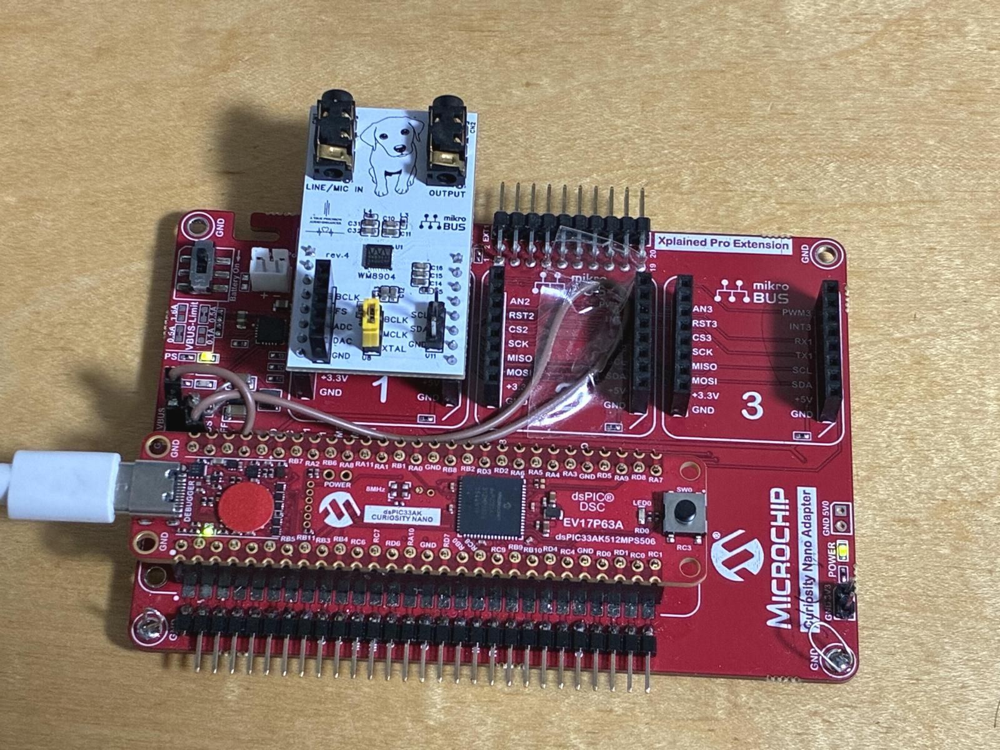

# dsPIC33AK512MPS506 Audio DSP — Curiosity Nano

This repository is the Curiosity Nano port of the dsPIC33AK audio DSP project.
It targets the `dsPIC33AK512MPS506` with a WM8904 mikroBUS codec board, and the
Classic DRC configuration is the hardware-validated baseline.

## Supported configuration

`dsPIC33AK512MPS506_CLASSIC_DRC` is the only hardware-qualified and supported
target. AK512 legacy configurations and the AK128 configuration remain in the
source tree for regression coverage; their presence does not imply support.

## Hardware

| Item | Detail |
| --- | --- |
| MCU | `dsPIC33AK512MPS506` |
| Board | dsPIC33AK Curiosity Nano (EV17P63A) |
| Codec carrier | Curiosity Nano Base for Click boards, mikroBUS slot 1 |
| Codec | one WM8904 mikroBUS board, rev.4 route (`WM8904_PCB_REV4`) |
| Audio format | 48 kHz TDM8, 8 slots per frame |
| Clock | PLL1 output = 200 MHz from FRC; FCY = 100 MHz |
| Console | 230400 8N1 on UART1 over the on-board debugger CDC (`U1TX` = RC10, `U1RX` = RC11) |
| MPLAB X configuration | `dsPIC33AK512MPS506_CLASSIC_DRC` |
| MPLAB X tool | `pkobnano` (on-board debugger) |
| Toolchain | XC-DSC 3.31.01, `dsPIC33AK-MP_DFP` 1.5.269 |

In the validated baseline the WM8904 owns BCLK and FSYNC, so SPI1 runs as the
framed-SPI client. The codec board design is published separately at
[sulaolab/EasyEDA-WM8904-mikroBUS](https://github.com/sulaolab/EasyEDA-WM8904-mikroBUS).



*The validated setup: a dsPIC33AK Curiosity Nano (EV17P63A,
`dsPIC33AK512MPS506`) on the Curiosity Nano Base for Click boards, with the
WM8904 rev.4 mikroBUS codec board in slot 1. The console reaches the host over
the Nano's own USB connection to the on-board debugger.*

## Current validated baseline

- Classic DRC: **141 DF2T biquad stages per channel × 4 DSP channels**
  — 564 section instances per sample frame
  (`BIQUAD_CASCADE_4CH_NUM_STAGE` 141, `STAGE_2_PROC_CH` 4; the console reports
  this as `[stage=141 total=564]`).
- Audio operation is running and verified on AK506 Nano hardware.
- That configuration measures 98.5% peak DSP load (98.4% current window) with
  an 8.6-us measured response margin.
- A coefficient CSV update was verified on the board in the normal high-load
  use case, and audio was confirmed to be operating normally afterwards.

Large coefficient transfers have a real-time limitation while audio is running.
See [`docs_public/ak506_nano_validation.md`](docs_public/ak506_nano_validation.md)
for the measured boundary and the recommended transfer workflow.

## Build

The command-line toolset under [`buildtools/`](buildtools/) is the supported
build route, and it shares its active selection with MPLAB X. Select, then
build:

```powershell
.\buildtools\switch_config.ps1 -SerialUpdateSupport No -Device dsPIC33AK512MPS506 -Profile "Classic DRC"
.\buildtools\build.ps1
```

`switch_config.ps1 -List` prints the catalog and the current selection without
changing anything. In the supported command-line workflow the MPLAB X
configuration is derived from the device and the profile, so
`dsPIC33AK512MPS506_CLASSIC_DRC` is a result of the selection above rather than
something you pick; selecting it directly in the IDE is of course still
possible. This device builds a standalone application only.

The build product is
`dist/dsPIC33AK512MPS506_CLASSIC_DRC/production/*.factory.production.hex`.
Copy that factory HEX image to the Curiosity Nano mass-storage programmer.
Confirm the programmed image from the console boot banner after the board
restarts; a mass-storage status file is not the acceptance record.

MPLAB X can also open [`dspic33ak_audio_dsp.X`](dspic33ak_audio_dsp.X/),
select `dsPIC33AK512MPS506_CLASSIC_DRC` and build or debug over the on-board
`pkobnano` debugger. See [`buildtools/README.md`](buildtools/README.md) for the
full scope of each script and the limits of the IDE route.

## Repository layout

| Path | Contents |
| --- | --- |
| [`src/app/apps/classic/`](src/app/apps/classic/) | Classic application, console and DSP blocks. |
| [`src/app/audio_transport/`](src/app/audio_transport/) | Audio transport runtime. |
| [`src/app/board/`](src/app/board/) | Board-level clock, audio pin routing and devices. |
| `src/app/hal_*/` | Peripheral hardware-abstraction layers. |
| [`src/app/uart_platform/`](src/app/uart_platform/) | UART/console platform layer. |
| [`dspic33ak_audio_dsp.X/`](dspic33ak_audio_dsp.X/) | MPLAB X project. |
| [`buildtools/`](buildtools/) | Build and configuration scripts for the AK506 Nano workflow. |
| [`docs_public/`](docs_public/) | AK506 Nano build, validation and test documentation. |

## License

Original SulaoLab contributions are licensed under
[MIT No Attribution](LICENSE) (MIT-0) — © 2026 SulaoLab. Vendored and adapted
third-party components keep their own licenses and use restrictions; see
[THIRD_PARTY_NOTICES.md](THIRD_PARTY_NOTICES.md).
